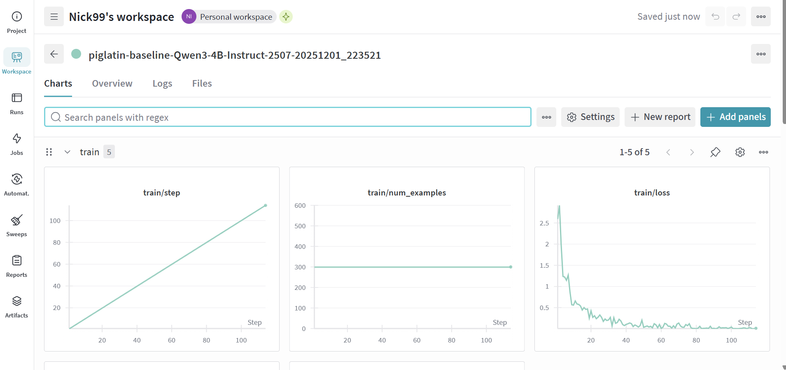
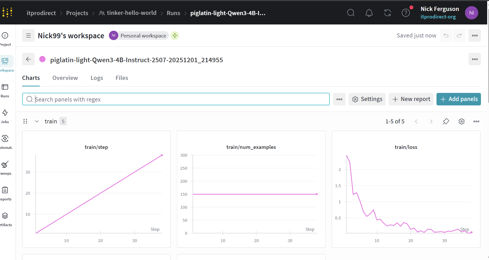
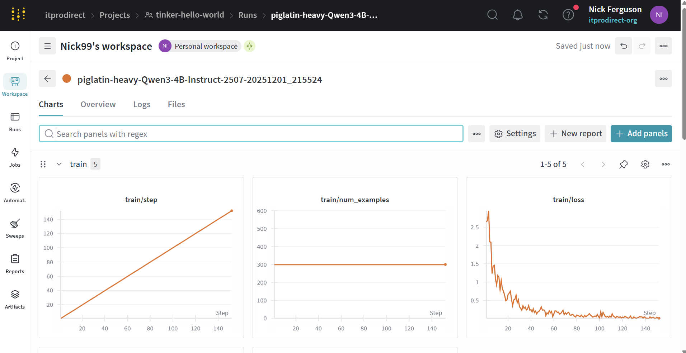

# Tinker Hello-World Notebooks

> Small, practical **LoRA + Tinker** playground with a real HF dataset and **Weights & Biases** logging.

[](https://www.python.org/)


This repo is my sandbox for learning and teaching:

- How to **fine-tune Tinker models with LoRA**
- How to **track experiments in Weights & Biases**
- How to keep a **clean, reproducible notebook workflow** with Git

It’s intentionally small and opinionated so other people can clone it and adapt it for workshops, tutorials, or their own experiments.

> Community note: this is an independent community project and is **not** affiliated with or endorsed by Thinking Machines Lab or Tinker.

---

## Notebook tour

| Notebook                                    | What it shows                                                                                                                     | Good for                                                        |
| ------------------------------------------- | --------------------------------------------------------------------------------------------------------------------------------- | --------------------------------------------------------------- |
| `00_check_env.ipynb`                        | Verifies Python, dependencies, and that your `.env` / API key are wired up correctly.                                             | “Does this machine actually work with Tinker?” sanity check.    |
| `01_tinker_hello_LoRA_world.ipynb`          | Minimal **LoRA fine-tune** on a tiny basketball example, based on the original demo.                                              | First end-to-end LoRA run with as little noise as possible.     |
| `02_basketball_prompt_distillation.ipynb`   | Simple **prompt-distillation** playground on a basketball scouting dataset.                                                       | Playing with prompt design and text-to-text transformations.    |
| `03_tinker_hello_LoRA_piglatin_wandb.ipynb` | Real **Pig Latin HF dataset**, LoRA fine-tuning on `Qwen3-4B-Instruct`, and full **Weights & Biases** logging + inference helper. | A “hello-world experiment harness” for future multi-model runs. |

Supporting files:

- `data/basketball_distillation/scouting_examples.jsonl` – tiny basketball examples for the distillation notebook.
- `.env.example` – template for your local secrets.
- `requirements.txt` – minimal Python dependencies.
- `test_env.py` – quick CLI check that your API key is loaded and Tinker is reachable.

---

## Screenshots

### Pig Latin training run (Weights & Biases)



This run trains a LoRA adapter on ~300 Pig Latin examples for 3 epochs.

You can clearly see the **train loss** drop from ~2.5 → ~0.001 and track:

- `train/loss`
- `train/epoch`
- `train/step`
- `train/batch_size`
- `train/num_examples`

Perfect for showing people what a healthy toy training run looks like.

---

## Quickstart

### 1. Clone the repo

```bash
git clone https://github.com/itprodirect/Tinker-hello-world-notebooks.git
cd Tinker-hello-world-notebooks
```

### 2. Create and activate a virtual environment

```bash
python -m venv .venv
# Windows
.venv\Scripts\activate
# macOS / Linux
source .venv/bin/activate
```

### 3. Install dependencies

```bash
pip install -r requirements.txt
```

### 4. Configure environment variables

```bash
cp .env.example .env
```

Edit `.env` and paste in your **Tinker API key** (and optional W&B API key if you prefer env-based auth).

### 5. Verify your setup

```bash
python test_env.py
```

You should see something like:

```text
TINKER_API_KEY present: True
Tinker client created successfully.
```

Once that passes, you’re ready for notebooks.

---

## Running the notebooks

1. Start Jupyter:

   ```bash
   jupyter lab        # or: jupyter notebook
   ```

2. Open `notebooks/00_check_env.ipynb` and **Run All** to confirm:

   - The right Python interpreter is used
   - Dependencies import cleanly
   - `.env` is being picked up

3. Then open **one** of:

   - `01_tinker_hello_LoRA_world.ipynb`

     - Walk through the original LoRA demo.
     - Good first run if you’re new to Tinker or LoRA.

   - `02_basketball_prompt_distillation.ipynb`

     - Play with rewriting / distilling basketball scouting notes.
     - Useful if you care about applied text workflows more than training.

   - `03_tinker_hello_LoRA_piglatin_wandb.ipynb`

     - Uses a real Pig Latin dataset sampled to ~300 rows.
     - Trains a LoRA adapter on `Qwen/Qwen3-4B-Instruct-2507`.
     - Logs metrics to **Weights & Biases** (`tinker-hello-world` project).
     - Includes a `piglatin_demo()` helper so you can type an English phrase and see the model respond.

4. For the Pig Latin notebook, make sure you either:

   - Run `wandb.login()` once and paste your API key in the notebook, **or**
   - Export `WANDB_API_KEY` in your shell and let W&B pick it up automatically.

---

## Why this repo might be useful to you

- **New to LoRA / Tinker?**
  Start with `01_*` and `03_*` to see what a full fine-tuning cycle looks like with minimal noise.

- **Teaching or mentoring?**
  Clone/fork this as a **workshop starter kit** – small dataset, fast runs, clear metrics.

- **Experiment tracking demo**
  `03_tinker_hello_LoRA_piglatin_wandb.ipynb` is a nice, low-risk way to show non-ML folks how W&B charts evolve during training.

- **Git + notebooks hygiene**
  The repo shows a simple, repeatable pattern for:

  - Keeping notebooks in a dedicated `notebooks/` folder
  - Storing secrets in `.env` (ignored by Git)
  - Using a tiny script (`test_env.py`) to smoke-test the environment

---

## Ideas for future extensions

These are intentionally left as “next steps” and not baked into the core flow so the repo stays lightweight:

- **Multi-model comparison**
  Run the Pig Latin notebook against several base models and compare loss curves in W&B.

- **Train/validation split**
  Add a small held-out set and log `val/loss` alongside `train/loss` to talk about overfitting.

- **More real-world datasets**
  Swap in non-toy data (legal, cybersecurity, sports, etc.) while reusing the same LoRA + W&B harness.

If you build on this for your own experiments or workshops, feel free to open an issue or PR so others can see different variations.

---

## License

This project is released under the [MIT License](LICENSE).

### Notebook 03 – Pig Latin LoRA + W&B experiment presets

This notebook fine-tunes a small LoRA adapter on a Pig Latin dataset and logs training to Weights & Biases (W&B).  
At the top of the notebook you can choose between three experiment presets by setting `EXPERIMENT_NAME`:

- `baseline` – original settings (rank 16, 300 rows, 3 epochs)
- `light` – quicker / cheaper run (rank 8, 150 rows, 2 epochs)
- `heavy` – slower / more thorough run (rank 32, 300 rows, 4 epochs)

Each run logs loss curves to W&B so you can compare how the presets behave.

**Baseline**


**Light**



**Heavy**


